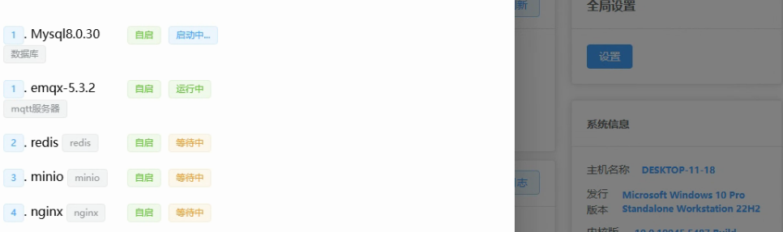
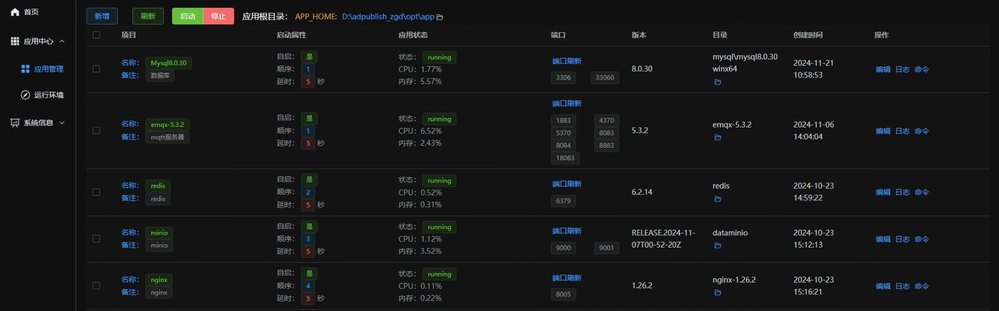
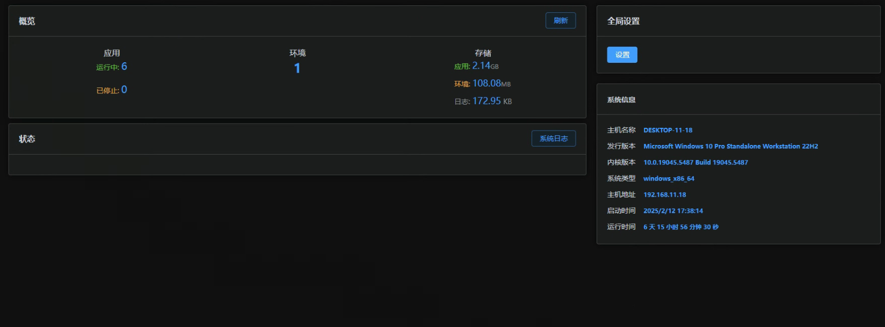
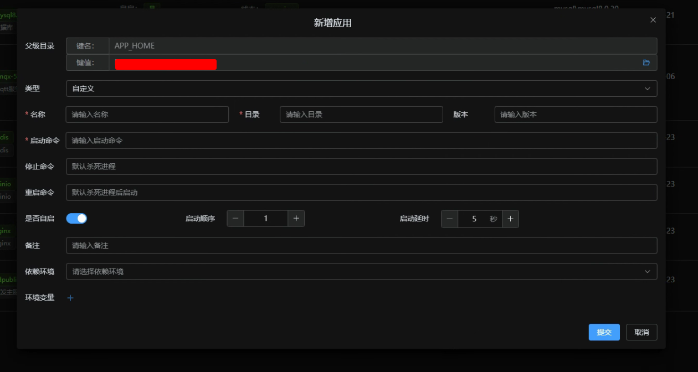

# 通用应用面板-客户端

## 1. 项目概述
- **项目名称**: 通用应用面板-客户端
- **开发语言**: Go (Golang) 和 JavaScript/TypeScript
- **前端框架**: Vue.js 和 Element UI
- **后端框架**: Wails 和 GORM
- **项目简介**: 通用应用面板-客户端是一个用于管理和监控应用程序的工具，
主要用于windows端进行服务端程序的管理，并提供用户友好的界面和丰富的功能。

## 2. 开发环境
- **Go 版本**: 1.21+
- **Node.js 版本**: 18.19+
- **Yarn 版本**: 1.22+
- **npm 版本**: 10.2.3

## 3. 开发框架
- **GORM**: 用于数据库操作的Go ORM库
- **Wails**: 用于构建跨平台桌面应用的Go框架
- **Vue.js**: 用于构建用户界面的前端框架
- **Element UI**: 基于Vue.js的UI组件库

## 4. 打包
- **linux 下 Windows 打包脚本**:
  ```bash
    #1、安装 mingw-w64
    export CGO_ENABLED=1
    export GOOS=windows
    export GOARCH=amd64
    export CC=x86_64-w64-mingw32-gcc
    export CXX=x86_64-w64-mingw32-g++
    VERSION=0.0.7
    BUILD_DATE=$(date +'%Y-%m-%d')
    BUILD_TIME=$(date +'%H:%M:%S')
    BUILD_GO_VERSION=$(go version)
    
    wails build -platform windows  \
    -ldflags " -s -w -H=windowsgui \
    -X 'main.version=$VERSION' \
    -X 'main.buildTime=$BUILD_TIME' \
    -X 'main.buildDate=$BUILD_DATE' \
    -X 'main.buildGoVersion=${BUILD_GO_VERSION}'" \
    -webview2 embed -upx
  ```
- **linux 下 Linux 打包脚本**:
  ```bash
    VERSION=0.0.7
    BUILD_DATE=$(date +'%Y-%m-%d')
    BUILD_TIME=$(date +'%H:%M:%S')
    BUILD_GO_VERSION=$(go version)
    
    wails build -platform windows  \
    -ldflags " -s -w -H=windowsgui \
    -X 'main.version=$VERSION' \
    -X 'main.buildTime=$BUILD_TIME' \
    -X 'main.buildDate=$BUILD_DATE' \
    -X 'main.buildGoVersion=${BUILD_GO_VERSION}'"
  ```

## 5. 安装指南
- **克隆项目**:
  ```bash
  git clone <项目仓库地址>
  cd <项目目录>
  ```

- **安装依赖**:
  ```bash
  yarn install
  ```

- **启动开发服务器**:
  ```bash
  wails dev
  ```


## 6. 使用说明
- **功能描述**:
    - 管理应用程序的启动和关闭
    - 监控系统进程
    - 提供用户友好的界面
- **支持系统**:
    - Windows:10,11,12
    - Windows server 2016 及更高版本
    - linux及相关发行版
- **命令参数**:
    - 版本：-v, --version
- **项目截图**:
    - 启动

       
    - 应用

       
    - 首页

       
    - 新增 
     
       
## 7. 联系方式
- **项目维护者**: konglingyinxia@gmail.com

## 8. 贡献
- **贡献指南**: 欢迎任何形式的贡献，包括但不限于报告错误、改进文档、提交代码等。